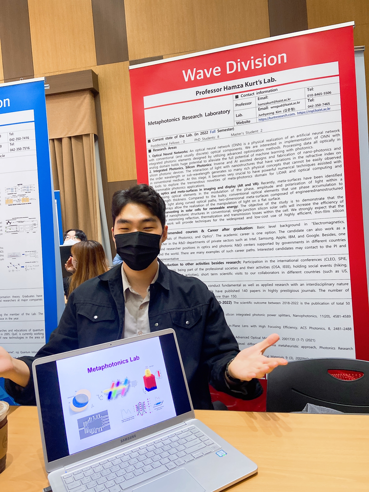

<br/>

## About me

I am Junhyeong Kim, Ph.D. from the KAIST Metaphotonics research lab., advised by prof. Hamza Kurt. 
I did research on various topics, including **intelligent (artificial intelligence assisted) and inverse design of nanophotonic devices**, **photonic neural networks**, **topological photonics**, etc.
Currently, I am working in SK hynix, South Korea.


Thank you for visiting my website! Please feel free to contact me :)



## Contact

```
Affiliation: Metaphotonics Research Lab., Department of Electrical Engineering, Korea Advanced Institute of Science and Technology (KAIST)
Email: wnsgud[at]kaist.ac.kr
```
