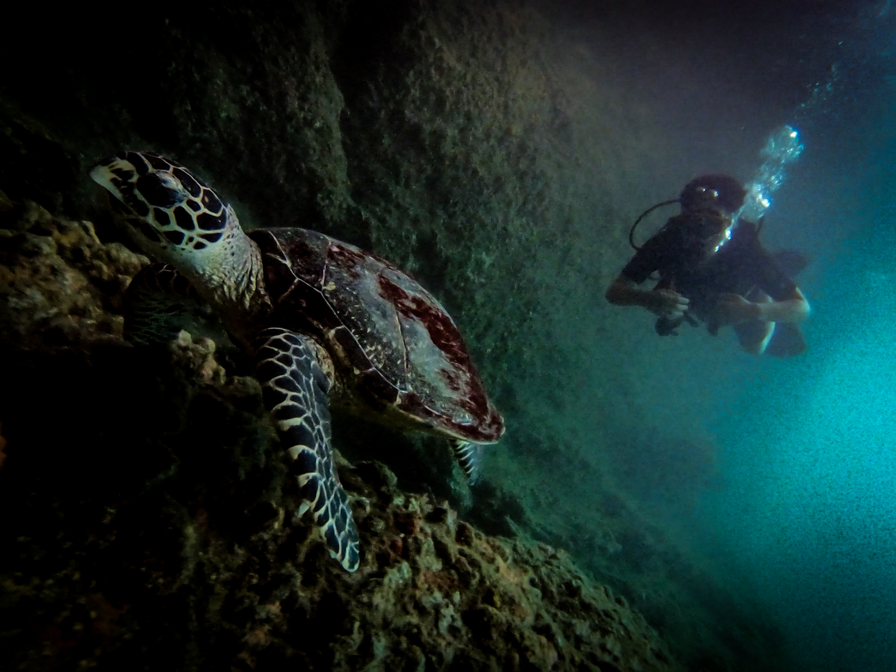
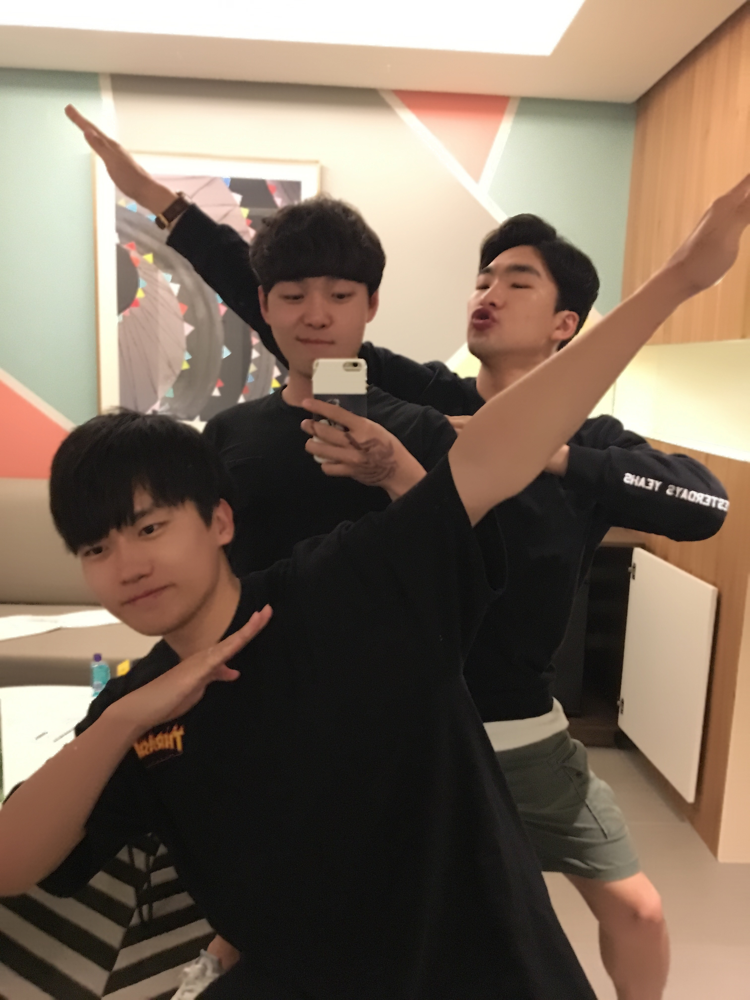

<br/>

## About me

I am Junhyeong Kim, Ph.D. candidate in the KAIST Metaphotonics research lab., advised by prof. Hamza Kurt. My current research interests are **intelligent (artificial intelligence assisted) and inverse design of nanophotonic devices**, **photonic neural networks**, **topological photonics**, etc.


Thank you for visiting my website! Please feel free to contact me :)



## Contact

```
Affiliation: Metaphotonics Research Lab., Department of Electrical Engineering, Korea Advanced Institute of Science and Technology (KAIST)
Email: wnsgud[at]kaist.ac.kr
```
