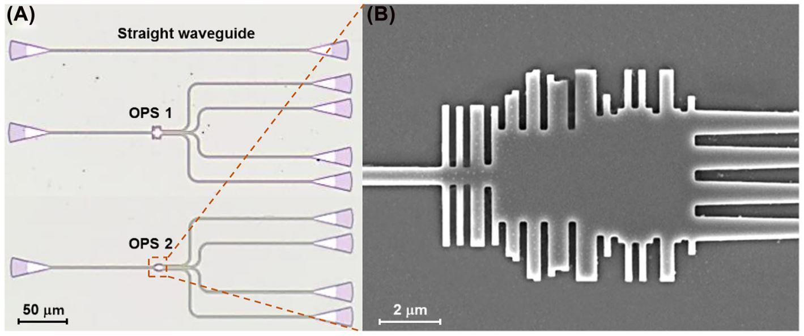

 

# Research areas
---
## Nanophotonics
Over the past several decades, **nanophotonic structures** of subwavelength scale enabled the light-matter interaction with outstanding optical effects. Manifold applications including **sensing, imaging, optical computing, and programmable photonics** can be accomplished in this scheme. 

One of the most appealing features of nanophotonics is that it allows low-cost mass production of the devices through CMOS-compatible fabrication processes. You can find an example of the fabricated chip in the below figure.

## Inverse design of nanophotonic devices
Conventionally, researchers have manually scanned parameter spaces and then optimized their structure using intuition and knowledge. Even though this method has resulted in a history of highly competent devices, it can also be outdated, slow, and inefficient. These drawbacks have led to the implementation of **inverse design** algorithms when designing photonic devices. These inverse design methods allow researchers to scan many parameters at the same time and to produce non-intuitive structures which meet the needs of small-scale devices and today’s technological demands. Because of their free-form geometry, inverse-designed structures can be prepared which **manipulate light specifically for the defined problem, resulting in high-performance devices.** You can find an example of the inverse-designed result in the below figures.

     

## Deep learning
Even though conventional design algorithms are still being used as powerful design tools, they can take an excessive amount of time and iterations when the design problem becomes more complex, and the obtained solution may correspond to a local optimum. These drawbacks have stimulated interest in **artificial neural networks (ANNs)** as an alternative design tool for photonic devices. Currently, I am trying to apply intelligent generative models to generate nanophotonic devices. 

